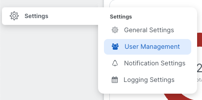
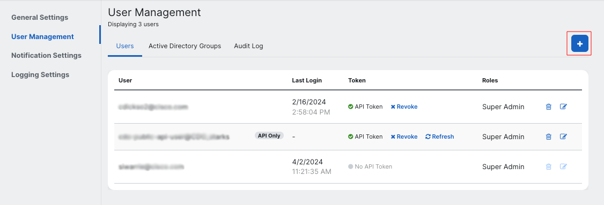
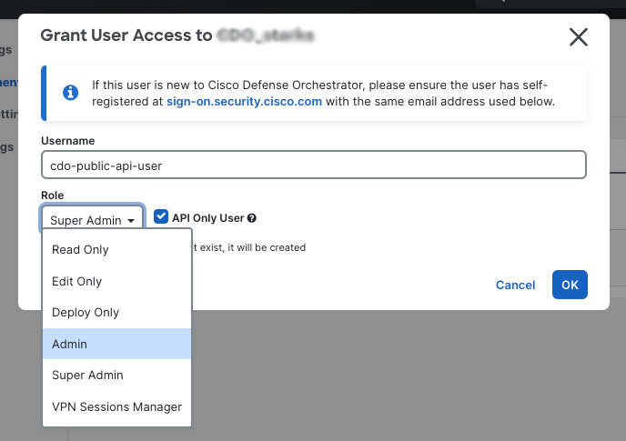
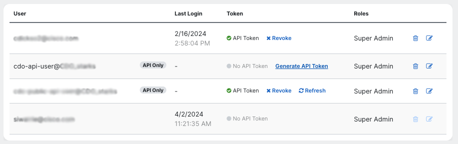
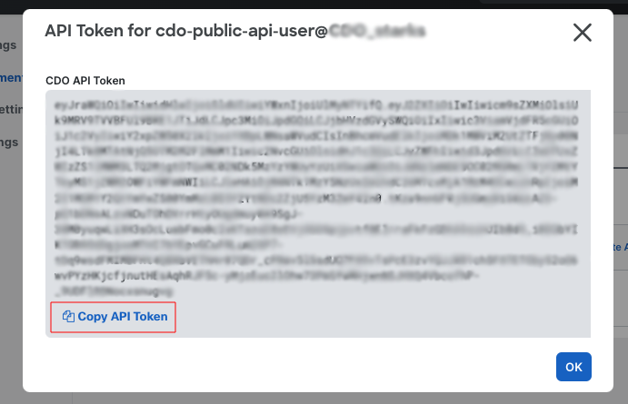
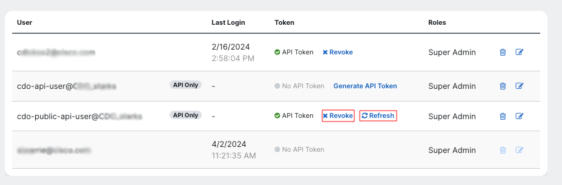

# Authentication

All requests to Security Cloud Control APIs must be authenticated using the Bearer token method for the tenant you want to make requests for. You can generate an API token (which does not expire) by logging into Security Cloud Control and going to the Settings page. We recommend creating an [API-only user](https://docs.defenseorchestrator.com/c-secure-device-connector-sdc.html#!t-create-api-only-users.html) so that your scripts are not tied to a single implementation.

You can do this as follows:

- Log in to your Security Cloud Control tenant and click on **Settings** -> **User Management**.

- Click on the **+** button to add a new user.

- In the dialog that opens up, give the API-only user a name, select the checkbox labelled `API Only User`, and select the role you want the API-only user to have (see below for a description of the roles in Security Cloud Control).

- Click on the **OK** button.
- Click on the **Generate API Token** button.

- Click on the **Copy API Token** button in the dialog that opens up. Save this token somewhere safe, as you will not be able to access it. 

You can use this API token to make Security Cloud Control API requests.

## The Security Cloud Control Token

The Security Cloud Control token follows the JSON Web Token (JWT) standard. The claims in the Security Cloud Control token are:
- `Roles`: This specifies the Security Cloud Control roles assigned to the user the token belongs to.

| Role | Privileges |
| ---- | ---------- |
| [ROLE_SUPER_ADMIN](https://edge.us.cdo.cisco.com/content/docs/index.html#!c-super-admin-role.html) | Super Admin users have complete access to all aspects of Security Cloud Control. |
| [ROLE_ADMIN](https://edge.us.cdo.cisco.com/content/docs/index.html#!c-admin-role.html) | Admin users can do everything except Super Admin users can, except for creating Security Cloud Control user records and changing user roles. |
| [ROLE_READ_ONLY](https://edge.us.cdo.cisco.com/content/docs/index.html#!c-read-only-role.html) | Read-Only users cannot make configuration changes to Security Cloud Control. |
| [ROLE_EDIT_ONLY](https://edge.us.cdo.cisco.com/content/docs/index.html#!c-edit-only-role.html) | Edit-Only users can edit and save device configurations, read in configuration changes made outside of Security Cloud Control, and utilize the Change Request Management Action. They cannot deploy changes to devices. |
| [ROLE_DEPLOY_ONLY](https://edge.us.cdo.cisco.com/content/docs/index.html#!c-deploy-only-role.html) | Deploy-only users cannot make configuration changes, but can deploy changes that have already been made on Security Cloud Control to devices. |
| [ROLE_VPN_SESSION_MANAGER](https://edge.us.cdo.cisco.com/content/docs/index.html#!c-vpn-sessions-manager-role.html) | The VPN Sessions Manager role is designed for administrators monitoring remote access VPN connections, not site to site VPN connections. | 

- `parentId`: The `parentId` claim provides the unique identifier of the Security Cloud Control tenant this token was issued for.
- `exp`: Time after which the JWT expires. This claim is absent in API tokens that do not expire. 
- `clusterId`: The unique identifier of the underlying Security Cloud Control cluster that this tenant uses.

>**Note**:
This claim does not validate the JWT token, as a token that has not yet expired could have been revoked.

### Token Expiry

Security Cloud Control supports two kinds of user-facing JWT tokens:
- *Time limited access tokens*: These tokens are used by Security Cloud Control itself to make API calls in the Security Cloud Control UI, and have an expiry of 1 hour. These access tokens can be refreshed using the associated refresh token. You cannot generate time-limited Security Cloud Control access tokens using the Security Cloud Control UI or API.
- *API tokens*: These tokens are used by Security Cloud Control API users to build automations. These tokens do not expire. You can refresh or revoke the API token for a user (super-admins only) by going to the **User Management** page (click on **Settings** -> **User Management** in the Security Cloud Control UI).

