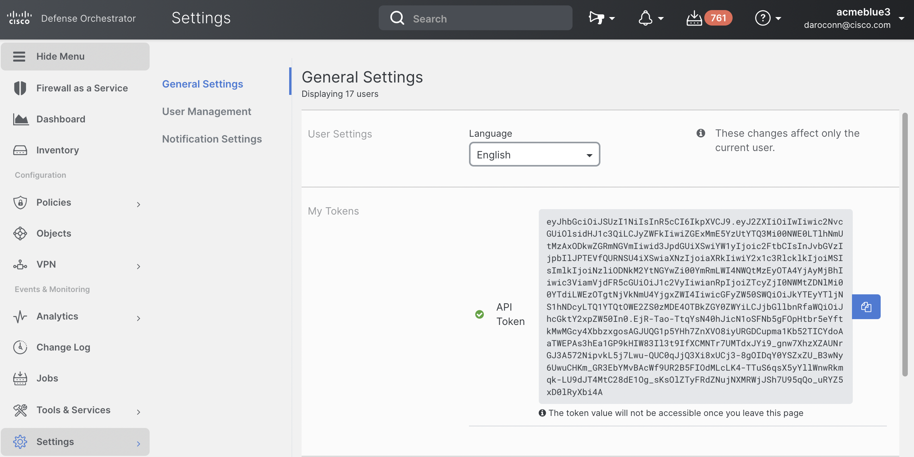

# Getting Started

The resources in the CDO API support one or more of the `GET`, `POST`, `PATCH`, and `DELETE` operations. **Note:** Not all of the resources support all of these operations. 
- **GET**: There are two kinds of `GET` operations in CDO: list `GET` operations, which return a paged list of resources, and individual `GET` operations which return a single resource by UID. In the list endpoints, it is possible to search and sort by a subset of the fields in the resource.
- **POST**: `POST` operations are used in CDO to either create a resource or trigger an asynchronous operation. All POST operations with an action verb trigger asynchronous operations. Asynchronous operations can be tracked using the CDO transaction API.
- **DELETE**: `DELETE` operations are used in CDO to delete resources. All `DELETE` operations in the CDO API are idempotent.
- **PATCH**: `PATCH` operations are used in CDO to modify resources. 

All responses from the CDO API are in the JSON format. Additionally, all payloads must be sent to the CDO API as JSON.

## API Resources
At a high level, the CDO API supports operations on the following resources:
- **Inventory Management** - Manage devices, device managers, cloud services, and templates in your CDO tenant.
- **Connector Management** - Add, remove, and view information on connectors used to communicate with devices in your CDO tenant.
- **Cloud-delivered FMC** - Manage the Cloud-delivered FMC in your CDO tenant (if present).
- **Object Management** - Manage firewall policy objects in your CDO tenant.
- **User Management** - Manage users in your CDO tenant.
- **Tenant Management** - Manage your CDO tenant, or Managed Service Portal.
- **Remote Access Monitoring** - View and manage the Remote Access Virtual Private Network (RA VPN) sessions, and Multi-factor Authentication (MFA) events in your CDO tenant.
- **Search** - Perform searches across all of the resources in your CDO tenant.
- **Changelogs** - View a detailed history of all changes made to your CDO tenant.
- **Change Requests** - Manage change requests, which can be used to associate changes made to your security policy on CDO with external change-management systems.
- **Transaction Management** - CDO transactions are used to track the progress of asynchronous operations triggered using the API on your CDO tenant. For example, use CDO transactions to monitor the progress of deploying configuration to an ASA.
- **Meta endpoints** - Meta information about CDO itself.

## Base URI

Cisco Defense Orchestrator is deployed in multiple regions, and the API is available in all of these. The server URL for each region is as follows:

- US: https://edge.us.cdo.cisco.com (use this if the CDO URL you visit is https://www.defenseorchestrator.com)
- EU: https://edge.eu.cdo.cisco.com (use this if the CDO URL you visit is https://www.defenseorchestrator.eu)
- APJ: https://edge.apj.cdo.cisco.com (use this if the CDO URL you visit is https://apj.cdo.cisco.com)

## Authentication

All requests to CDO APIs must be authenticated using the Bearer token method for the tenant you want to make requests for. You can generate an API token (which does not expire) by logging into CDO and going to the Settings page. We recommend creating an [API-only user](https://docs.defenseorchestrator.com/c-secure-device-connector-sdc.html#!t-create-api-only-users.html) so that your scripts are not tied to a single implementation.

### The CDO Token

The CDO token follows the JSON Web Token (JWT) standard. The claims in the CDO token are:
- `Roles`: This specifies the CDO roles assigned to the user the token belongs to.

| Role | Privileges |
| ---- | ---------- |
| [ROLE_SUPER_ADMIN](https://edge.us.cdo.cisco.com/content/docs/index.html#!c-super-admin-role.html) | Super Admin users have complete access to all aspects of CDO. |
| [ROLE_ADMIN](https://edge.us.cdo.cisco.com/content/docs/index.html#!c-admin-role.html) | Admin users can do everything except Super Admin users can, except for creating CDO user records and changing user roles. |
| [ROLE_READ_ONLY](https://edge.us.cdo.cisco.com/content/docs/index.html#!c-read-only-role.html) | Read-Only users cannot make configuration changes to CDO. |
| [ROLE_EDIT_ONLY](https://edge.us.cdo.cisco.com/content/docs/index.html#!c-edit-only-role.html) | Edit-Only users can edit and save device configurations, read in configuration changes made outside of CDO, and utilize the Change Request Management Action. They cannot deploy changes to devices. |
| [ROLE_DEPLOY_ONLY](https://edge.us.cdo.cisco.com/content/docs/index.html#!c-deploy-only-role.html) | Deploy-only users cannot make configuration changes, but can deploy changes that have already been made on CDO to devices. |
| [ROLE_VPN_SESSION_MANAGER](https://edge.us.cdo.cisco.com/content/docs/index.html#!c-vpn-sessions-manager-role.html) | The VPN Sessions Manager role is designed for administrators monitoring remote access VPN connections, not site to site VPN connections. | 

- `parentId`: The `parentId` claim provides the unique identifier of the CDO tenant this token was issued for.
- `exp`: Time after which the JWT expires. This claim is absent in API tokens that do not expire. **Note:** This claim does not validate the JWT token, as a token that has not yet expired could have been revoked.
- `clusterId`: The unique identifier of the underlying CDO cluster that this tenant uses.
